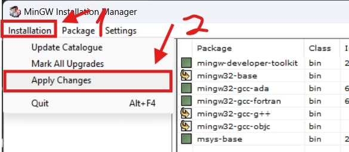
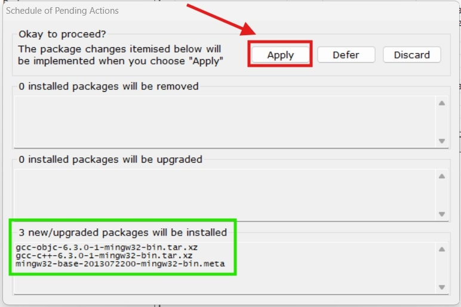
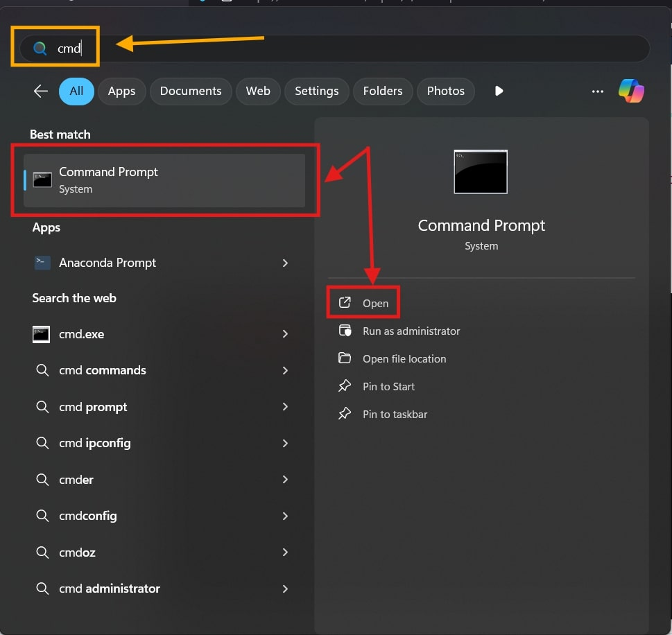

## Tabla de contenido
- [Paso 1: Descarga MinGW](#paso-1-descarga-mingw)
- [Paso 2: Instala MinGW](#paso-2-instala-mingw)
- [Paso 3: Selecciona paquetes](#paso-3-selecciona-paquetes)
- [Paso 4: Aplica cambios e instala paquetes](#paso-4-aplica-cambios-e-instala-paquetes)
- [Paso 5: Abre la configuración avanzada de variables de entorno](#paso-5-abre-la-configuración-avanzada-de-variables-de-entorno)
- [Paso 6: Agrega una nueva dirección en tu variable de entorno `Path`](#paso-6-agrega-una-nueva-dirección-en-tu-variable-de-entorno-path)
- [Paso bonus: Confirmar que el compilador está instalado](#paso-bonus-confirmar-que-el-compilador-está-instalado)
___
**[Compilar](https://developer.mozilla.org/es/docs/Glossary/Compile)** es el proceso de traducir un programa escrito en un lenguaje (como *C*, *C++* o *Java*) en otro formato o lenguaje, usualmente *código máquina* o *ensamblador*. Un **compilador** es un programa que realiza dicha tarea.

El código de C/C++ necesita ser compilado primero para poder correrlo. Por ende, es necesario un compilador. A continuación te voy a enseñar paso a paso como instalar **MinGW**, que es una colección de compiladores para Windows.
:::tip[CONSEJO]
Todo lo que esté en rojo y naranja en las imágenes está enfocado.
:::
:::warning[AVISO]
Esta guía fue extraída de la guía que hice en Discord, así que no fue modificada demasiado, a excepción del inicio. Si hay alguna inexactitud o error, por favor dejame saber para mejorar este artículo.
:::
## Paso 1: Descarga MinGW
Dirígete a https://sourceforge.net/projects/mingw/ y descarga el instalador.

Deberías obtener un archivo ejecutable llamado `mingw-get-setup.exe`. Procede a abrirlo.

## Paso 2: Instala MinGW
Cuando aparezca esta ventana, procede a instalar el compilador.

Recomiendo darle a continuar, pero si gustas puedes cambiar la dirección de donde se instalará el compilador (no recomendable).

Procederá a descargar el catálogo. Una vez completado, procede.

Va a aparecer esta ventana. Aquí verás varios paquetes que puedes instalar.

Una breve descripción de cada uno (**leer es opcional**, es meramente informativo):
1. `mingw-developer-toolkit`: Este metapaquete contiene los componentes necesarios para crear una instalación de MSYS relativamente completa y adecuada para la mayoría de las necesidades de los desarrolladores de MinGW.
2. `mingw32-base`: Este paquete se utiliza para compilar el programa C, incluyendo el enlazador y otras herramientas binarias.
3. `mingw32-gcc-ada`: Este paquete proporciona la implementación MinGW del compilador del lenguaje GNU Ada.
4. `mingw32-gcc-fortran`: Lo mismo, pero para el lenguaje GNU FORTRAN.
5. `mingw32-gcc-g++`: Este paquete se utiliza para compilar código fuente C++.
6. `mingw32-gcc-objc`: Este paquete se utiliza para compilar lenguaje C objetivo.
## Paso 3: Selecciona paquetes
Procede a marcar los siguientes paquetes para instalarlos.

`mingw32-base`, `mingw32-gcc-g++` y `mingw32-gcc-objc`.

## Paso 4: Aplica cambios e instala paquetes
Dirígete a "Installation > Apply Changes". Esto aplicará los cambios que realizamos.

Presiona en "Apply" para aplicar. Tus componentes serán instalados.

Una vez terminado, puedes cerrar esta ventana y la ventana del instalador... ¡listo! Tu compilador ya está instalado, pero tu sistema no sabe donde se encuentra el directorio del compilador, así que todavía no puedes usarlo en VSC (Visual Studio Code).

## Paso 5: Abre la configuración avanzada de variables de entorno
Busca el panel de control.

Dirígete a Sistema y Seguridad.

Después Sistema.

Abre la configuración avanzada.

Entra a Variables de Entorno.

## Paso 6: Agrega una nueva dirección en tu variable de entorno `Path`
Selecciona Path, y después presiona Editar.

Aparecerá esta ventana. Presiona en Nuevo, y después en Buscar.

Busca la dirección de `MinGW`, y después la carpeta `bin`. Si no cambiaste la dirección predeterminada, debería estar en `C:\MinGW\bin`. Una vez seleccionada, procede a darle OK.

Procede a darle otra vez OK, asegúrandote que la dirección de `bin` esté añadida a la lista.

Otra vez.

Por última vez, presiona OK. Por favor, **asegúrate de presionar todos los OK necesarios, NO CIERRES LAS VENTANAS**, si lo haces, no se guardarán tus cambios, y tendrás que hacer el paso 6 de nuevo.

¡Listo! Ya tu compilador está instalado y tu sistema ya sabe donde está ubicado.
## Paso bonus: Confirmar que el compilador está instalado
Para confirmar que realmente está instalado todo perfectamente, procede a abrir el Command Prompt, o CMD.

Copia y pega la siguiente línea en la terminal: `g++ --version`. Si te aparece la versión como en la imagen, entonces quiere decir que todo se instalo correctamente. Ahora puedes tomarme el descansito que te mereces.
