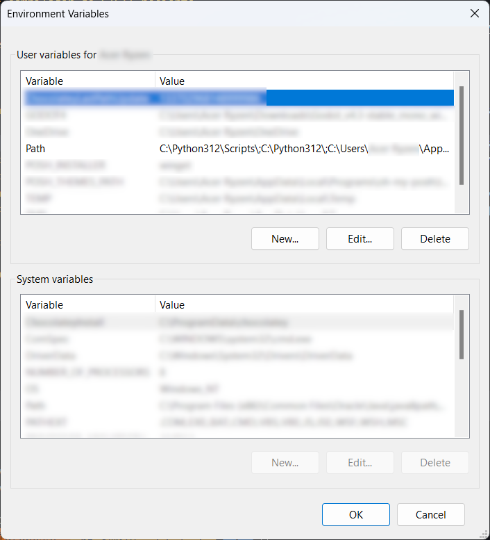

## Tabla de contenido
- [Paso 1: Instalar compilador de C/C++](#paso-1-instalar-compilador-de-cc)
    - [Confirmar versión de compilador](#confirmar-versión-de-compilador)
    - [Instalar compilador de C/C++ reciente](#instalar-compilador-de-cc-reciente)
- [Paso 2: Descargar plantilla rápida de Raylib](#paso-2-descargar-plantilla-rápida-de-raylib)
- [Paso 3: Construir y descargar Raylib](#paso-3-construir-y-descargar-raylib)
- [Bonus: ¿Cómo usar Raylib?](#bonus-cómo-usar-raylib)
___
**[Raylib](https://www.raylib.com/)** es una biblioteca de código abierto que permite a los desarrolladores crear videojuegos en 2D y 3D de manera sencilla.

Bueno... **vayamos al grano**. Instalar Raylib es un poco más complicado de lo que parece, pero si sigues estos pasos, deberías poder instalarlo sin problemas. Técnicamente, existen diferentes formas de "instalar" Raylib, pero en este artículo te voy a enseñar de la forma que un Staff de Raylib me enseñó.
## Paso 1: Instalar compilador de C/C++
> "No es necesario, ya lo tengo instalado." - Tú, probablemente.

Lo sé, pero, ¿estás realmente seguro que tienes la versión más reciente de tu compilador? 

> "¿Para qué si ya tengo el compilador instalado?"

Según el Staff de Raylib, y citando sus palabras, *"necesitas conseguir una versión decente del compilador en primer lugar, la que tienes (MinGW) es basura y no funcionará con Raylib"*. Si con esto no te convencí, entonces no sé qué más decirte.
### Confirmar versión de compilador
1. Abre la terminal CMD o PowerShell (asumiendo que estás en *Windows*).
2. Escribe `gcc --version` y presiona Enter.
3. Si te sale algo similar a esto...
```bash
gcc.exe (MinGW.org GCC-6.3.0-1) 6.3.0
Copyright (C) 2016 Free Software Foundation, Inc.
```
...entonces tienes una versión vieja de tu compilador. Si te sale algo similar a esto...
```bash
gcc.exe (GCC) 14.2.0
Copyright (C) 2024 Free Software Foundation, Inc.
```
...entonces tienes una versión reciente de tu compilador.

4. Si tu compilador es viejo, sigue leyendo. Si no, puedes saltarte al [paso 2](#paso-2-descargar-e-instalar-raylib), pero incluso si ya tienes una versión reciente, te recomiendo seguir leyendo por si acaso.
### Instalar compilador de C/C++ reciente
Antes de comenzar, es importante mencionar que aunque técnicamente puedes mantener MinGW, es recomendable eliminarlo ya que es considerado obsoleto. En su lugar, vamos a instalar un kit de desarrollo llamado **[w64devkit](https://github.com/skeeto/w64devkit)**.

::github{repo="skeeto/w64devkit"}

Para eliminar MinGW, simplemente debes eliminar la carpeta donde se instaló. Si no sabes dónde está, puedes buscarla más adelante en la variable de entorno `Path`.

Ahora, para instalar **w64devkit**, sigue estos pasos:
1. Dirígete a [esta página](https://github.com/skeeto/w64devkit/releases/tag/v2.0.0) y descarga el archivo `w64devkit-x64-2.0.0.exe`.
2. Abre el ejecutable. Deberías ver algo similar a esto:

Haz clic en el botón `...` y selecciona la carpeta donde quieres extraer los archivos. Haz clic en `Extract` después de seleccionar la carpeta. Recomiendo extraerlo en `C:\` o `C:\Users\{tu_usuario}\`.
3. Ya que hayas extraído los archivos, ahora debes agregar la carpeta `w64devkit` a la variable de entorno `Path`. Para hacerlo, sigue estos pasos:
    1. Abre la barra de búsqueda y escribe `variables de entorno` o `environment variables`.
    2. Haz clic en `Editar las variables de entorno del sistema` o `Edit environment variables for your account`. Deberías ver algo similar a esto:
    
    3. En la sección `Variables de usuario para {tu_usuario}` o `User variables for {your_username}`, selecciona la variable `Path` y haz clic en `Editar`.
    
    4. Haz clic en `Nuevo`, `Buscar` (o `New`, `Browse`) y busca la carpeta `w64devkit` que extrajiste anteriormente, y selecciona `w64devkit\bin`.
    5. Haz clic en `Aceptar` o `OK` en todas las ventanas.
:::warning[AVISO]
Si en tu variable de entorno `Path` ya tienes una dirección que contiene `MinGW`, asegúrate de eliminarla, ya que como se mencionó previamante, **MinGW** es obsoleto, y si no lo eliminas, es posible que cause conflictos con **w64devkit**.
:::
Al terminar asegúrate de confirmar que tienes la versión correcta de tu compilador con `gcc --version`. Si todo salió bien, entonces puedes continuar. Si no, entonces te recomiendo que vuelvas a intentar instalar **w64devkit**.
## Paso 2: Descargar plantilla rápida de Raylib
Descarga los archivos de este repositorio:
::github{repo="raylib-extras/raylib-quickstart"}

Puedes hacerlo ya sea descargando el archivo ZIP o clonando el repositorio. Si decides descargar el archivo ZIP, simplemente extrae los archivos en una carpeta de tu elección. Si decides clonar el repositorio, simplemente abre la terminal, dirígete a la dirección donde quieres clonar el repositorio y corre el siguiente comando:
```bash
git clone https://github.com/raylib-extras/raylib-quickstart.git
```
Una vez descargado o clonado, si abres la carpeta en **Visual Studio Code**, deberías ver algo similar a esto:

Como puedes ver, `main.c` muestra errores debido a que no encuentra la biblioteca de **Raylib**, y es debido a que aún no la hemos instalado. Antes de instalarlo, si deseas usar **C++** en lugar de **C**, simplemente cambia el nombre del archivo `main.c` a `main.cpp`.
## Paso 3: Construir y descargar Raylib
Lo único que debes hacer es ejecutar el archivo `build-MinGW-W64.bat` (ya sea desde la terminal, el explorador de archivos, o **Visual Studio Code**). El proceso de construcción puede tardar aproximadamente 1 o 2 minutos, dependiendo de tu conexión a internet.

Una vez instalando es probable que debas reiniciar **Visual Studio Code** para que los cambios surtan efecto. Si `main.c` o `main.cpp` no muestra errores, entonces has instalado **Raylib** correctamente. ¡Felicidades! Ahora puedes comenzar a programar tus videojuegos en **Raylib**.
## Bonus: ¿Cómo usar Raylib?
Aprender a usar **Raylib** está fuera del alcance de este artículo, pero si deseas aprender a usarlo, te recomiendo que visites la [documentación oficial de Raylib](https://www.raylib.com/cheatsheet/cheatsheet.html). Ahí encontrarás todo lo que necesitas para comenzar a programar. También puedes darle un vistazo a los ejemplos oficiales de Raylib [aquí](https://www.raylib.com/examples.html).
