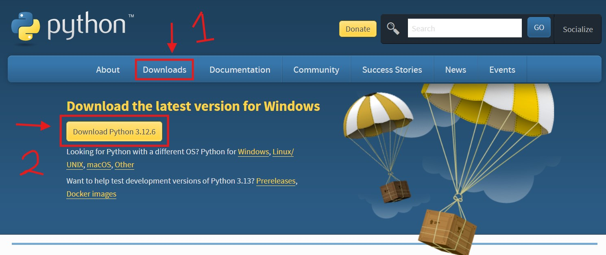
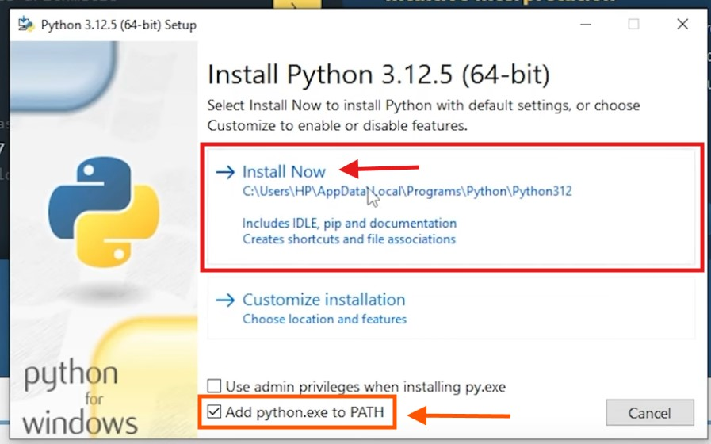
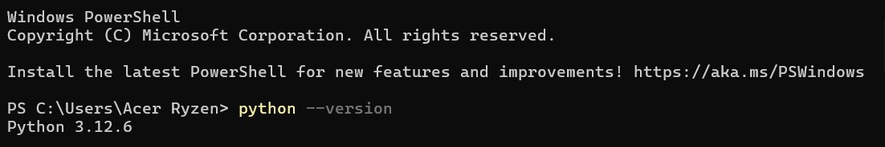
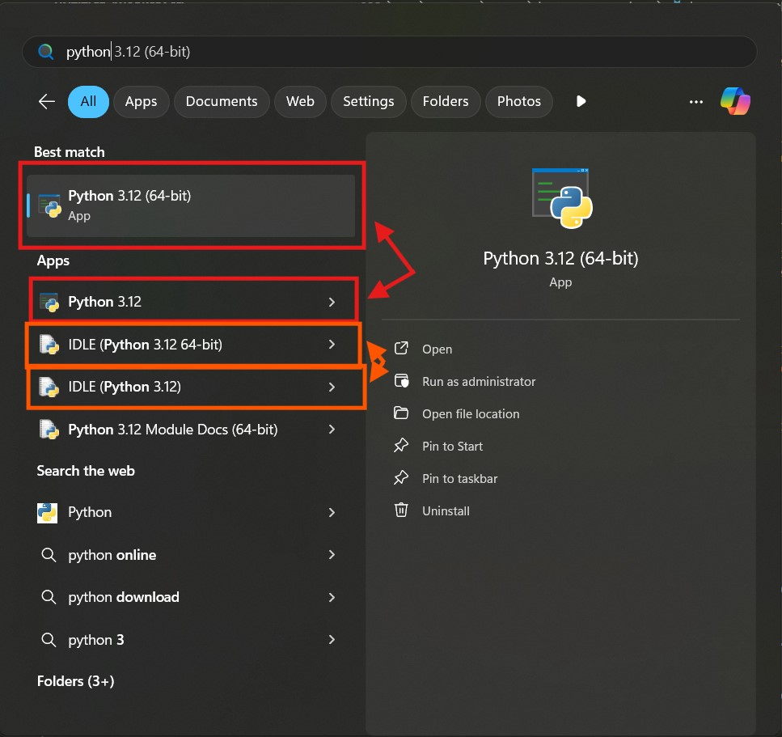

## Tabla de contenido
- [Preparación](#preparación)
    - [Instalación de Python](#instalación-de-python)
    - [Instalación de un editor de texto o un IDE](#instalación-de-un-editor-de-texto-o-un-ide)
        - [¿Cuál es la diferencia entre un editor de texto y un IDE?](#cuál-es-la-diferencia-entre-un-editor-de-texto-y-un-ide)
        - [Visual Studio Code](#visual-studio-code)
        - [Spyder](#spyder)
        - [PyCharm](#pycharm)
        - [Sublime Text](#sublime-text)
        - [Terminal](#terminal)
    - [Usar Python en línea](#usar-python-en-línea)
- [Tu primer script de Python](#tu-primer-script-de-python)
___
Antes de leer este artículo, recomiendo bastante que leas [Python 3 - Guía](/grupo932/posts/python-course-index/python-course-index/) para tener una introducción general sobre Python.

Existen varias formas de usar Python, ya sea en tu computadora local o en línea, y existen diferentes IDEs y editores de texto que puedes utilizar para escribir y ejecutar código Python. En este artículo, te mostraré cómo instalar Python, cómo ejecutar scripts de Python, y cómo usar Python en línea (no recomendado para proyectos grandes).
## Preparación
Para usar Python localmente, se necesita descargar e instalar 2 cosas:
1. **Python**: Puedes descargar Python desde el [sitio web oficial](https://www.python.org/downloads/). Asegúrate de descargar la última versión de Python 3.
2. **Un editor de texto o un IDE**: Puedes usar cualquier editor de texto, como [Visual Studio Code](https://code.visualstudio.com/), [Sublime Text](https://www.sublimetext.com/), o [Atom](https://atom.io/), o un IDE como [PyCharm](https://www.jetbrains.com/pycharm/) o [Spyder](https://www.spyder-ide.org/).
### Instalación de Python
Para instalar Python, sigue estos pasos:
1. Descarga el instalador de Python desde el [sitio web oficial](https://www.python.org/downloads/).

2. Ejecuta el instalador y sigue las instrucciones en pantalla.

3. Asegúrate de marcar la casilla "Add python.exe to PATH" durante la instalación.
4. Una vez instalado, abre una terminal o línea de comandos y escribe `python --version` para verificar que Python se ha instalado correctamente. Si no funciona, no te preocupes, existe otra forma de verificar la instalación, como veremos más adelante.

### Instalación de un editor de texto o un IDE
Lo que instalamos fue realmente el intérprete de Python, pero necesitamos un editor de texto o un IDE para escribir y ejecutar nuestros scripts de Python. Puedes instalar cualquier editor de texto o IDE que prefieras.
#### ¿Cuál es la diferencia entre un editor de texto y un IDE?
- **Editor de texto**: Un editor de texto es un programa que se utiliza para escribir y editar texto. Algunos editores de texto, como Visual Studio Code, tienen características adicionales que los hacen útiles para programar, como resaltado de sintaxis y autocompletado.
- **IDE (Entorno de Desarrollo Integrado)**: Un IDE es un programa que combina un editor de texto con herramientas adicionales para facilitar el desarrollo de software. Por ejemplo, un IDE puede tener un depurador integrado, un gestor de paquetes, y una consola interactiva.
#### Visual Studio Code
Si usas Visual Studio Code, puedes instalar la extensión de Python para obtener características adicionales, como resaltado de sintaxis, autocompletado, y depuración de código.

Enlaces:
- [Visual Studio Code](https://code.visualstudio.com/)
- [Extensión](https://marketplace.visualstudio.com/items?itemName=ms-python.python)
#### Spyder
Spyder es un IDE de código abierto diseñado específicamente para la programación científica y el análisis de datos. Viene preinstalado con muchas bibliotecas científicas y herramientas útiles para el análisis de datos, como NumPy, SciPy y Matplotlib.

Enlace: [Spyder](https://www.spyder-ide.org/)
#### PyCharm
PyCharm es un IDE de Python desarrollado por JetBrains. Tiene muchas características útiles, como resaltado de sintaxis, autocompletado, depuración de código, y soporte para pruebas unitarias. PyCharm también tiene una versión de pago con características adicionales.

Enlace: [PyCharm](https://www.jetbrains.com/pycharm/)
#### Sublime Text
Sublime Text es un editor de texto ligero y altamente personalizable que es popular entre los desarrolladores. Puedes instalar paquetes adicionales para agregar características de programación, como resaltado de sintaxis y autocompletado.

Enlace: [Sublime Text](https://www.sublimetext.com/)
#### Terminal
Si prefieres usar la terminal para escribir y ejecutar scripts de Python, puedes hacerlo. Simplemente escribe `python` en la terminal para abrir el intérprete interactivo de Python, o `python script.py` para ejecutar un script de Python llamado `script.py` (asegúrate de estar en el directorio correcto).

Además, al instalar el intérprete de Python, se instala también una terminal de Python, que puedes abrir desde el menú de inicio o buscando "Python" en tu computadora, y Python IDLE, que es un entorno de desarrollo integrado para Python muy básico.

Incluso si usas un IDE o un editor de texto, es útil saber cómo usar la terminal para ejecutar scripts de Python, ya que es una habilidad importante para cualquier programador de Python.
### Usar Python en línea
Si no puedes instalar Python en tu computadora o prefieres no hacerlo, también puedes usar Python en línea. Hay varios sitios web que te permiten escribir y ejecutar código Python directamente en tu navegador, incluyendo el sitio web oficial de Python: [Python.org](https://www.python.org/shell/).

No es recomendable usar Python en línea para proyectos grandes, ya que puede ser lento y limitado en funcionalidad. Sin embargo, es útil para probar pequeños fragmentos de código o para aprender Python sin instalar nada en tu computadora.
## Tu primer script de Python
Antes de terminar con este artículo, te mostraré cómo escribir y ejecutar tu primer script de Python. Abre tu editor de texto o IDE y crea un nuevo archivo. El nombre no importa, pero es importante que tenga la extensión `.py`. Escribe el siguiente código en el archivo:
```python
print("Hola, mundo!")
```
Guarda el archivo y ejecútalo desde la terminal o desde tu IDE. Deberías ver el mensaje "Hola, mundo!" impreso en la pantalla. ¡Felicidades! Has escrito y ejecutado tu primer script de Python.
:::tip[TIP]
Si usas la terminal de Python, no necesitas crear un archivo. Simplemente escribe `print("Hola, mundo!")` en la terminal y presiona Enter para ver el mensaje impreso en la pantalla.
:::
