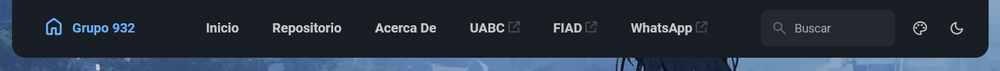
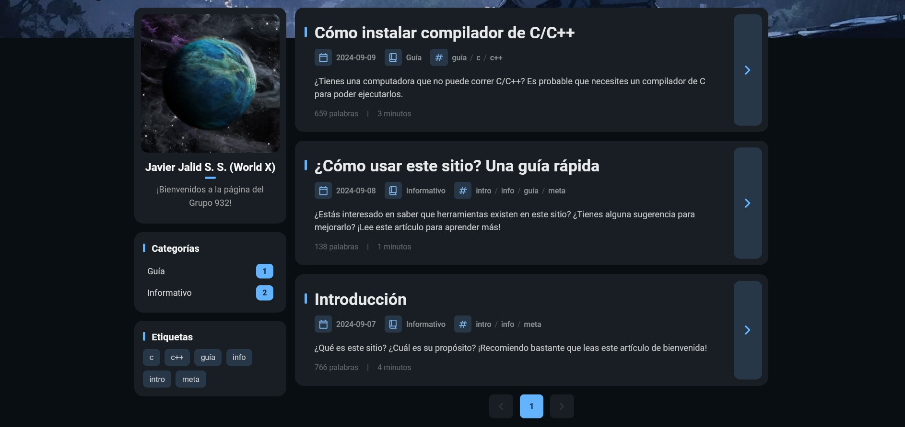

## Tabla de contenido
- [Barra de navegación superior](#barra-de-navegación-superior)
- [Página principal](#página-principal)
    - [Botones](#botones)
    - [Herramientas](#herramientas)
- [Repositorio](#repositorio)
- [Acerca De](#acerca-de)
- [Publicaciones](#publicaciones)
- [Herramientas, categorías y etiquetas](#herramientas-categorías-y-etiquetas)
___
Este sitio puede parecer tanto sencillo como confuso para quienes estén aquí por primera vez, y es probable que lo primero que estén pensando es...
> ¿Qué puedo hacer en este sitio? ¿Por dónde empiezo?

Si es así, entonces no te preocupes, ¡porque voy a explicarte a detalle todas las cosas que puedes (y no puedes) realizar!
## Barra de navegación superior

### Botones
- **Grupo 932**: Página principal del sitio.
- **Inicio**: Ídem.
- **Repositorio**: Muestra el archivero, como línea de tiempo, de todas las publicaciones en el sitio.
- **Acerca De**: Una página especial para mostrar información básica general y una bienvenida.
- **UABC**: Un enlace directo hacia la página oficial de la ***Universidad Autónoma de Baja California***.
- **FIAD**: Un enlace directo hacia la página oficial de la ***Facultad de Ingeniería, Arquitectura y Diseño***.
- **WhatsApp**: Un enlace directo hacia la página oficial de ***WhatsApp Web***.
### Herramientas
- **Buscar**: Puedes buscar publicaciones específicas en base a su contenido.
- **Color del tema**: Puedes personalizar la apariencia del sitio cambiando el color principal.
- **Modo**: Puedes cambiar la apariencia del sitio al modo oscuro, claro, o el que esté usando tu sistema.
## Página principal

Pendiente.
### Repositorio

Pendiente.
### Acerca De

Pendiente.
### Publicaciones

Pendiente.
### Herramientas, categorías y etiquetas

Pendiente.
