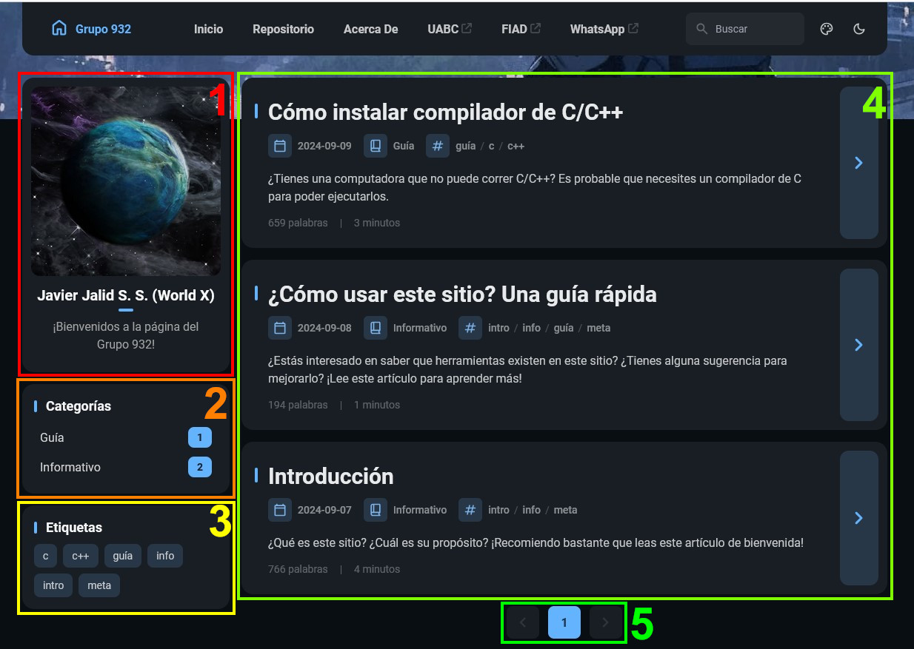
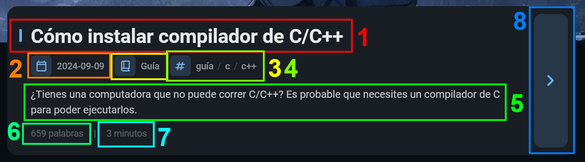
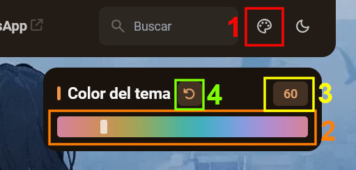
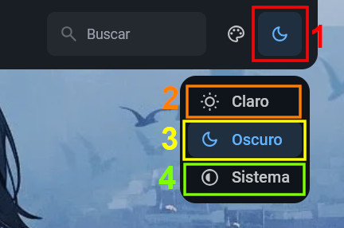
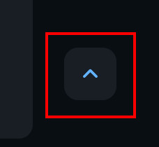

## Tabla de contenido
- [Barra de navegación superior](#barra-de-navegación-superior)
- [Página principal](#página-principal)
    - [Botones](#botones)
    - [Herramientas](#herramientas)
- [Repositorio](#repositorio)
- [Acerca De](#acerca-de)
- [Publicaciones (cartas)](#publicaciones-cartas)
- [Herramientas](#herramientas-1)
    - [Color del tema](#color-del-tema)
    - [Modo](#modo)
    - [Botón de ir arriba](#botón-de-ir-arriba)
___
:::important[IMPORTANTE]
Este sitio todavía está en fase de desarrollo. Es decir, algunas cosas podrían cambiar en el futuro.
:::
Este sitio puede parecer tanto sencillo como confuso para quienes estén aquí por primera vez, y es probable que lo primero que estén pensando es...
> ¿Qué puedo hacer en este sitio? ¿Por dónde empiezo?

Si es así, entonces no te preocupes, ¡porque voy a explicarte a detalle todas las cosas que puedes (y no puedes) realizar!
## Barra de navegación superior

### Botones
1. **Grupo 932**: Página principal del sitio.
2. **Inicio**: Ídem.
3. **Repositorio**: Muestra el archivero, como línea de tiempo, de todas las publicaciones en el sitio.
4. **Acerca De**: Una página especial para mostrar información básica general y una bienvenida.
5. **UABC**: Un enlace directo hacia la página oficial de la ***Universidad Autónoma de Baja California***.
6. **FIAD**: Un enlace directo hacia la página oficial de la ***Facultad de Ingeniería, Arquitectura y Diseño***.
7. **WhatsApp**: Un enlace directo hacia la página oficial de ***WhatsApp Web***.
### Herramientas
8. **Buscar**: Puedes buscar publicaciones específicas en base a su contenido.
9. **Color del tema**: Puedes personalizar la apariencia del sitio cambiando el color principal.
10. **Modo**: Puedes cambiar la apariencia del sitio al modo oscuro, claro, o el que esté usando tu sistema.
## Página principal

1. **Acerca De**. Pulsar en el Avatar te llevará a la página de ***Acerca De***. En la parte inferior está un texto de bienvenida.
2. **Categorías**. Lista de categorías y cuántas publicaciones existen con estas categorías. Puedes pulsar en cualquiera de éstas para acceder al ***Repositorio*** de publicaciones con todas las publicaciones que sean parte de esa categoría.
3. **Etiquetas**. Ídem, pero con etiquetas en lugar de categorías.
4. **Lista de publicaciones (cartas)**. Todas las publicaciones en el sitio desplegadas de forma descendente (del más reciente al más viejo); cada publicación es mostrado en una "carta" que incluye información básica, incluyendo: su título, su fecha de creación, su categoría, sus etiquetas, descripción básica (solo mostrado en la carta, no en la publicación misma), la cantidad de palabras, la duración de lectura, el enlace al artículo, y una imagen de portada (opcional).
5. **Páginas**. Para ver publicaciones más viejas.
## Repositorio

1. **Línea de tiempo**. Muestra, de forma descendente como lista, la información más básica de todas las publicaciones. Si es accedido desde el la barra de navegación superior por medio de ***Repositorio***, mostrará todas las publicaciones en el sitio. Por otro lado, si es accedido por medio de una categoría o etiqueta, entonces desplegará todas las publicaciones que sean parte de esa categoría o tengan esa etiqueta.
2. **Año**. Las publicaciones son separados principalmente por años de creación.
3. **Cantidad de publicaciones**. Cuántas publicaciones fueron creadas ese año.
4. **Lista de publicaciones**. La información de las publicaciones publicadas ese año.
5. **Fecha de creación**. Mes y día, respectivamente, en el que la publicación fue creado.
6. **Título**. El título de la publicación.
7. **Etiquetas**. Algunas o todas las etiquetas que tiene la publicación.
## Acerca De
Es una publicación especial que contiene información muy básica o general. El contenido de ***Acerca De*** puede cambiar en el futuro, pero por el momento muestra el horario, cómo se creo esta página (de forma muy superficial), y una lista breve de características que me gustaría implementar en el futuro.

Accesible desde la barra de navegación superior o el avatar en el lado izquierdo. No puede ser accedido desde el ***Repositorio*** o la ***Página principal***.
## Publicaciones (cartas)

En la página principal, las publicaciones se muestran por medio de cartas, mostrando su información básica. Cada carta contiene los siguientes elementos.
1. **Título**. El título de la publicación. Puedes pulsar aquí para acceder a ésta.
2. **Fecha de creación**. Cuándo fue creado.
3. **Categoría**. La categoría a la que pertenece la publicación.
4. **Etiquetas**. La etiqueta o etiquetas relacionados con el artículo.
5. **Descripción básica**. Una descripción breve sobre la publicación. No aparece en el artículo, solo en la carta.
6. **Cantidad de palabras**. Cuántas palabras hay en el artículo.
7. **Tiempo de lectura**. Duración estimada de cuánto tiempo podría tomarte para leer el artículo entero, de principio a final.
8. **Botón**. Pulsa aquí para acceder al artículo. Algunos artículos también pueden mostrar una imagen aquí.
## Herramientas
### Color del tema
Desde la barra de navegación superior puedes cambiar el color del tema del sitio. Esta configuración es guardado localmente, así que siempre que accedas a este sitio desde tu navegador, tu color será aplicado y actualizado inmediatamente.

1. Accede a la configuración del ***color del tema***.
2. Cambia la matiz del color moviendo la barra, con paso de 5.
3. Muestra el valor de la matiz del color (0 al 360).
4. Cambia al valor de color predeterminado (250).

### Modo
Como el ***color del tema***, también puedes cambiar el modo del sitio. Ésta es una configuración local.

1. **Claro**. Recomendable usar de día, o en lugares con mucha iluminación.
2. **Oscuro**. Recomendable usar de noche, o en lugares con poca iluminación.
3. **Sistema**. El modo será seleccionado automáticamente, dependiendo del modo que usa tu computadora o celular.

### Botón de ir arriba

Mira al lado derecho y notarás que hay un botón con un ícono de una flecha que apunta hacia arriba. Como podrás adivinar, al pulsarlo éste te llevará hasta la parte superior de la página. Ya este es el final de la guía, así que... ¡pruébalo!