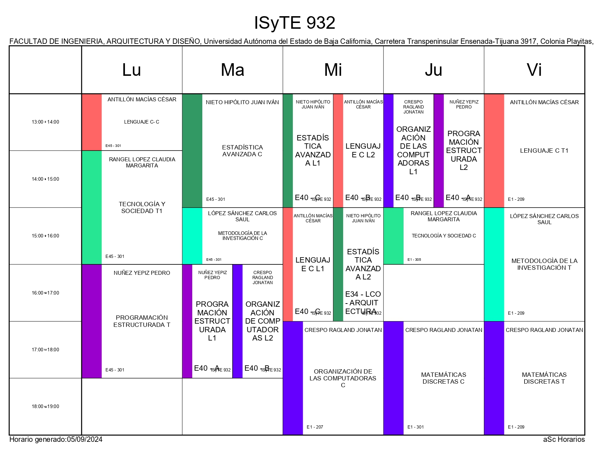

# Acerca De
## Horario

## Bienvenida
¡Bienvenidos a la página del Grupo 932 de la FIAD de la UABC!
Este sitio fue creado por Javier Jalid, con la meta de crear un sitio web donde el grupo pueda acceder a información, guías, documentación, entre otras cosas, de forma más conveniente y rápida.

Recomiendo bastante que lean los siguientes artículos para comenzar:
1. [Introducción](https://world-x.github.io/grupo932/posts/introduction/)
2. [¿Cómo usar este sitio? Una guía rápida](https://world-x.github.io/grupo932/posts/what-to-do-here/)

Cualquier duda, pregunta, o sugerencia puedes acércarte conmigo presencialmente o por medio de WhatsApp o Discord.

Este sitio fue hecho con la plantilla [Fuwari](https://github.com/saicaca/fuwari) y [Github Pages](https://pages.github.com/), y no está afiliada con la ***Universidad Autónoma de Baja California***, la ***Facultad de Ingeniería, Arquitectura y Diseño***, ni ningún otro grupo, organización, o individuo además de mí.

::github{repo="saicaca/fuwari"}

## Pendiente
- Agregar más artículos y publicaciones
- Cambiar el horario por algo más dinámico y estéticamente consistente
- Mejorar presentación de artículos existentes
- Escuchar la opinión del grupo
- Más...